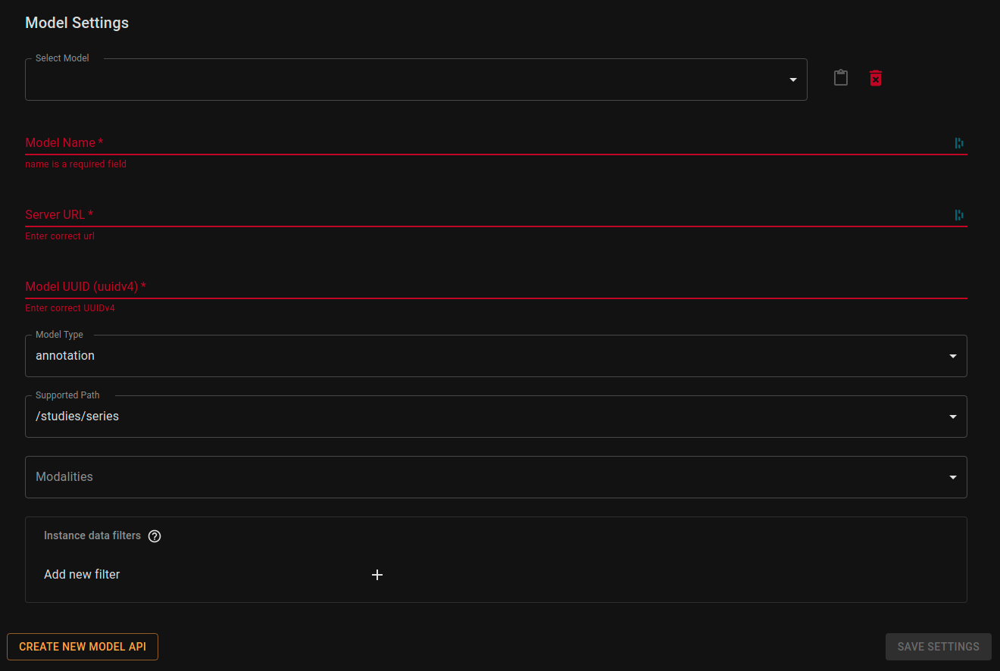

## Accessing model settings

To access server settings select `Settings` option form the main navigation and make sure `AI Models` tab is selected:


## Adding new model to the viewer.

> This guide assumes you already have a model API. If you don't please follow the instructions to [Setup your Local Model API](/latest/setting-up-local-model-api).

When the list is not complete, and you want to add your server to it just click the `Create New Model API` button (bottom left of the page). That should create empty form for you to edit:



As you can see, this model API is not on the list and is not a valid API yet. You have to enter required fields and `Save Settings` at the end.

## Modifying existing model

Usually you should have a list of models defined by your organization and available without setting them manually. Chose one by selecting it from the `Select Model` dropdown.


After modifying settings confirm your choice by clicking on `Save Settings` button (bottom right of the page).

### List of fields:
- __Model Name__ - Just a display name, visible on the list of servers
- __Server URL__ - Server to send requests to. If you're using our [Model Proxy](/latest/setting-up-model-proxy) then it would be `https://localhost:8002`
- __Model UUID__ - UUIDv4 of model API avaiable though [Model Proxy](/latest/setting-up-model-proxy)
- __Model Type__ - One of supported types inferences (`segmentation` | `annotation` | `prediction`).
- __Supported Path__ - One of supported data types for inference. This value determines the type od data that model receives through proxy. If your model supports more than one path, then just add it twice with different options.
```shell
/studies
/studies/series
/studies/series/instances
```
- __Modalities__ - If your model is restricted to specific modalities then select them from the list. Otherwise, it will be available for every modality.