### Accessing model settings

To access model settings select __Settings__ option form the main navigation and make sure __AI Models__ tab is selected.

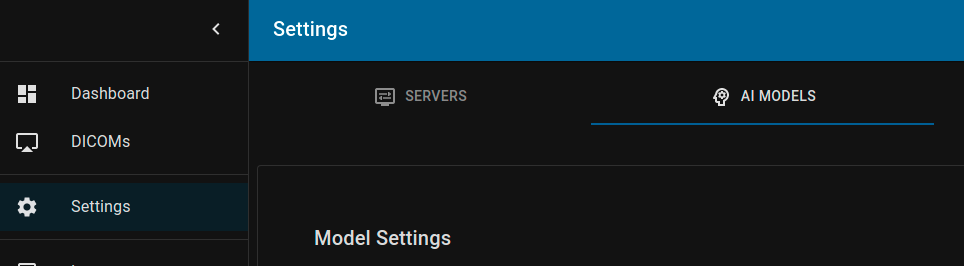

Then scroll down to __Series data filters__ or __Instance data filters__ (depends on the model's __Supported Path__).

## Instances from the series

1. Set __Supported Path__ to `/studies/series`
2. Add __Instance data filters__ by clicking on __Add new filter__

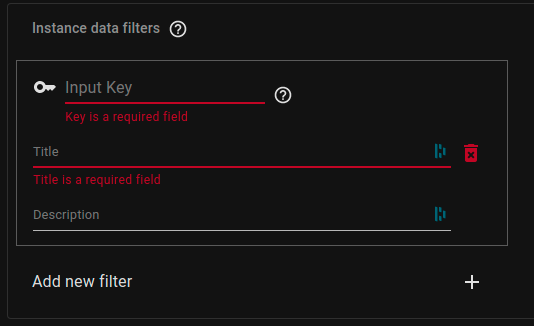

Each filter consists of 3 fields:
- __Input Key__ - key sent to the model along with the instance assigned to it. It has to be alphanumeric (hyphen also allowed). Each key has to be unique within the model.
- __Title__ - title displayed to the user of the model.
- __Description__ - (optional) additional information that should make it clearer which data should be assigned to this filter.

### Example

I want to select 2 instances from selected study:

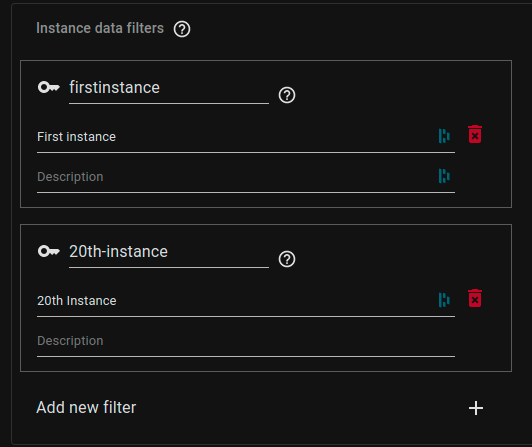

Now, when selecting model for inference, __Select instances for inference__ view will be available:

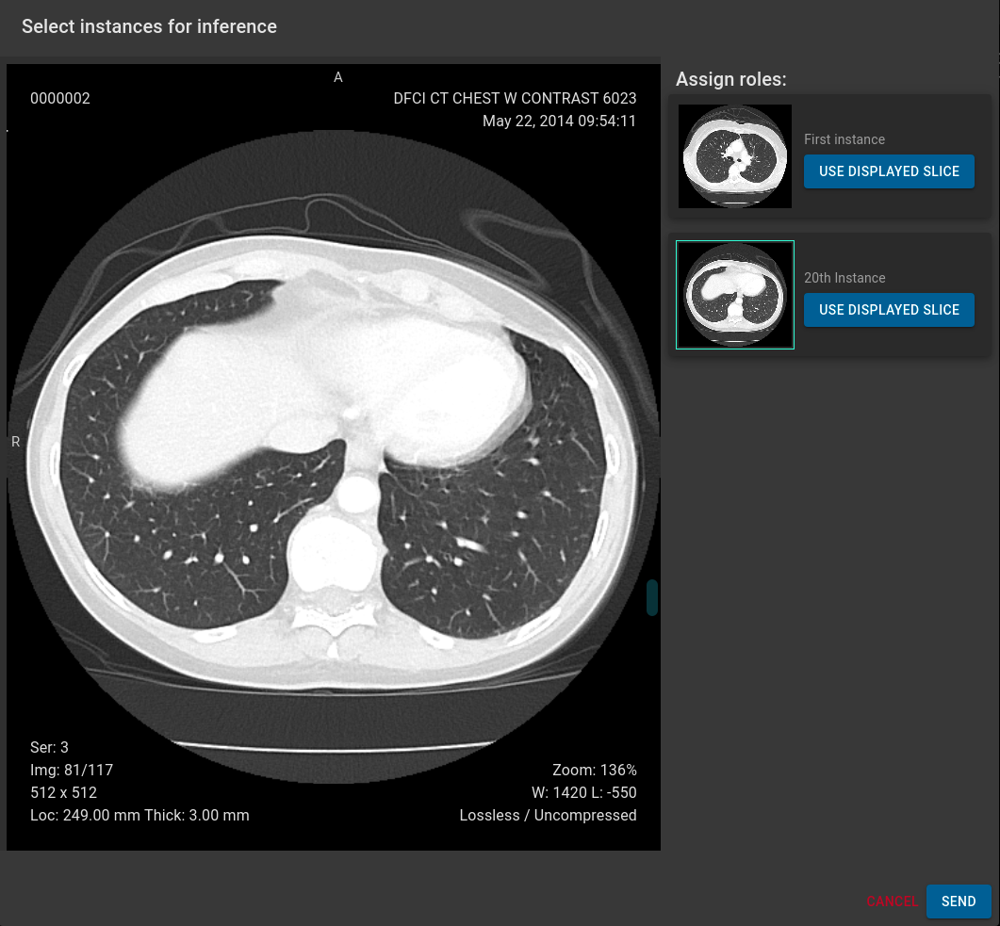

To select instance, scroll to desired slice and click on __USE DISPLAYED SLICE__ button. Instance will be assigned to this filter. If all instances are assigned then __SEND__ button becomes available.

## Series from the study

1. Set __Supported Path__ to `/studies`
2. Add __Series data filters__ by clicking on __Add new filter__

Each filter consists of 3 fields:
- __Input Key__ - key sent to the model along with the series assigned to it. It has to be alphanumeric (hyphen also allowed). Each key has to be unique within the model.
- __Title__ - title displayed to the user of the model.
- __Description__ - (optional) additional information that should make it clearer which data should be assigned to this filter.

### Example

I want to get 3 different MRI axial planes from the study:
- _Subcallosal line_
- _Brainstem vertical line_
- _Reid’s baseline_

Each axial place is stored as a separate series inside the study data.

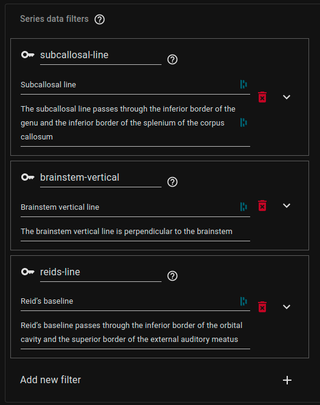

This fill require the use to assign one series to every filter:

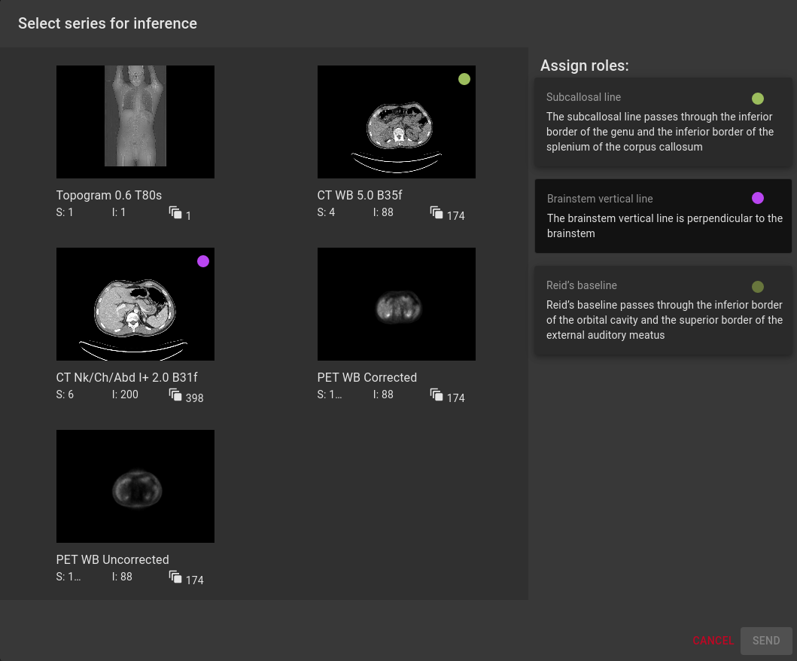

## Series and Instances from the study

1. Set __Supported Path__ to `/studies`
2. Add __Series data filters__ by clicking on __Add new filter__
3. Expand newly created filter using arrow on the right 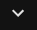 
4. Add Instance data filter by clicking on nested __Add new filter__

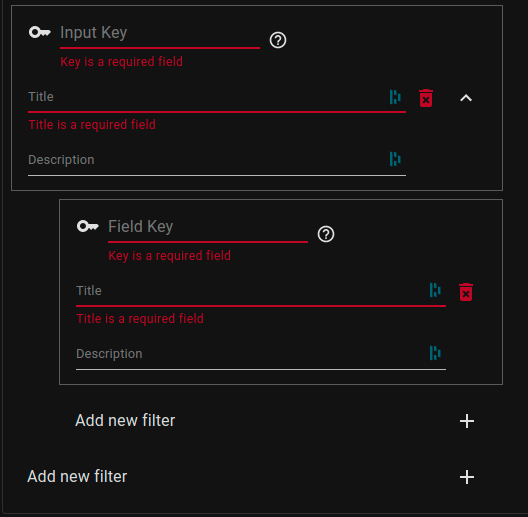

Nested filters (instances) are automatically assigned to the parent (series) and for the series filter to be valid, user has to assign all instances.

Each filter consists of 3 fields:
- __Input Key__ - key sent to the model along with the series/instance assigned to it. It has to be alphanumeric (hyphen also allowed). Each key has to be unique within the model.
- __Title__ - title displayed to the user of the model.
- __Description__ - (optional) additional information that should make it clearer which data should be assigned to this filter.

### Example

I want to get instances from 2 series
- 2 Instances from CT Lung scan
- 1 Instance from full body scan

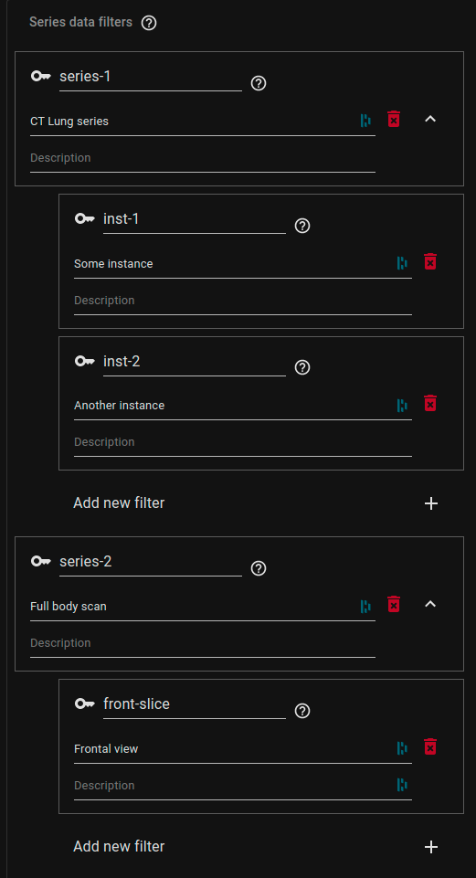

When defining the filter like that, user will be presented with nested view during the inference process. The first job is to select proper series:

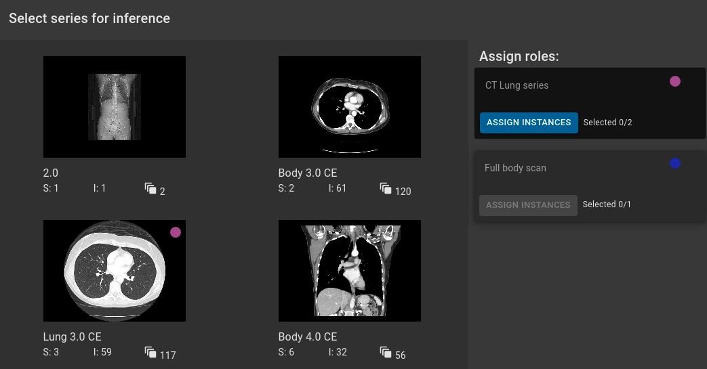

After selecting series, __ASSIGN INSTANCES__ button becomes available. Next to the button is the number of instances _selected/required_. To select instances for a given series, please click on this button. Application will switch to the _Instance Filter_ view:

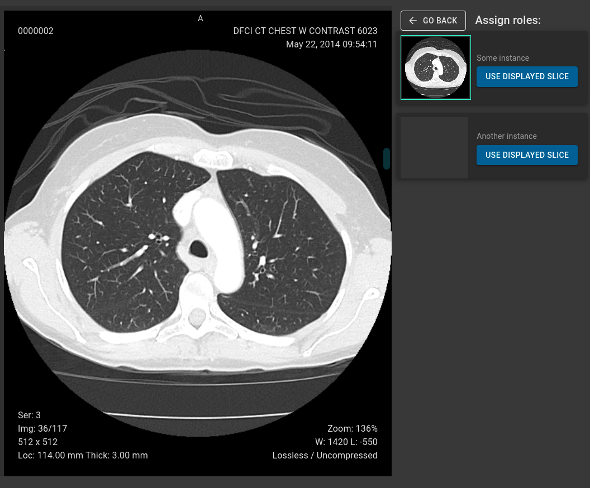

To select instance, just scroll to desired slice and click __USE DISPLAYED SLICE__ button (next to instance definition). This will copy displayed slice and assign it to the instance.