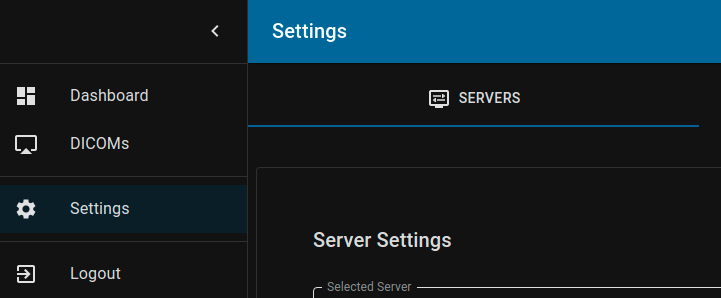

## Accessing server settings

To access server settings select `Settings` option form the main navigation and make sure `Servers` tab is selected:

## Selecting sever

Usually you should have a list of servers defined by your organization and available without setting them manually. Chose one by selecting it from the `Selected Server` dropdown.

After that confirm your choice by clicking on `Save Settings` button (bottom right of the page). Now in the `DICOMs` section, all study data should be loaded from selected PACS.

## Adding new server to the viewer.

> This guide assumes you already have a server that is available and secured with TSL. If you don't please follow the instructions to [Setup your Local PACS server](/latest/setting-up-local-pacs).

When the list is not complete, and you want to add your server to it just click the `Create New Server` button (bottom left of the page). That should create empty form for you to edit:

As you can see, this server is not on the list and is not a valid server yet. You have to enter required fields and `Save Settings` at the end.

### List of fields:
- __Server Name__ - Just a display name, visible on the list of servers
- __Server URL__ - Valid URL to the DICOM server. This path should be compatible with DICOMWeb standard and has to start with `https://`. If you're using our local server then it will look like `https://localhost/zhiva/pacs` or `https://192.168.1.2/zhiva/pacs` if the server is not on your local machine.
- __Authentication Type__ - Authentication type used by the server.
- __Server UUID__ - UUIDV4 of the server. If the server is used for inference it should have one. This UUID is sent along with the inference request to the model (see [`server` property](latest/setting-up-model-proxy#requesting-inference-for-given-model)).
- __Server Postfix__ - Any string that is part of the server url. Usually empty but some of the servers have additional postfix like `https://server.mydomain.com/pacs/DCM4CHEE` where `DCM4CHEE` is a `postfix`.
- __WADO URI Postfix__ - Another postfix in case the `WADO` (_Web Access DIICOM Objects_) protocol requires it. Usually `wado`.
- __WADO Postfix__ - If there is additional postfix after `WADO URI` then put it here. Often the value `rs` (_Request/Response_) is used but some servers doesn't have that requirement.
- __QIDO Postfix__ - Postfix for QIDO (_Query based on ID for DICOM Objects_) protocol. Works the same as other postfixes. Often `rs` but some servers leave it empty.
- __QIDO Supports Include Field__ - Whether QIDO supports __Include Fields__ option. It is used to retrieve additional metadata when requesting list of studies/series.
- __Image rendering protocol__ - Prefix for retrieving image data from the server. Usually it's `wadors` or `wado` but might be `https`.
- __Thumbnail rendering protocol__ - Prefix for retrieving thumbnail data from the server. Usually it's `wadors` or `wado` but might be `https`. Most of the servers use the same value as for __Image rendering protocol__ but if you have extra thumbnail server this value might differ.
- __Enable Study LazyLoad__ - Do not load the whole study at once. Only load selected series (speeds up loading)
- __Supports Fuzzy Matching__ - Does server supports _Fuzzy Matching_ when searching for Studies? ([Our Local Server](/latest/setting-up-local-pacs) does)

### zhiva.ai Local Server Setup

We've created predefined server settings for [Our Local Server](/latest/setting-up-local-pacs). It is available under `Local Server` option. You might want to modify the `Server URL` to accommodate your local network settings. If you running the server on your local machine then leave `localhost` as hostname. If the server is somewhere in your network then change `localhost` to servers' IP address (sth. like `192.168.x.x`).

If you've changed other settings that affect the URL change them as well in the setting.

## Authentication

### Basic Auth

If your server is not available publicly and requires a login and password you can provide that information by selecting __Authentication Type__.

Selecting `Basic Auth` value allows you to enter credential that will be then used by the application to connect to PACS server. If you're using [our Local Server](/latest/setting-up-local-pacs) you can read more about securing your server in the [Authentication](/latest/setting-up-local-pacs#authentication) section.