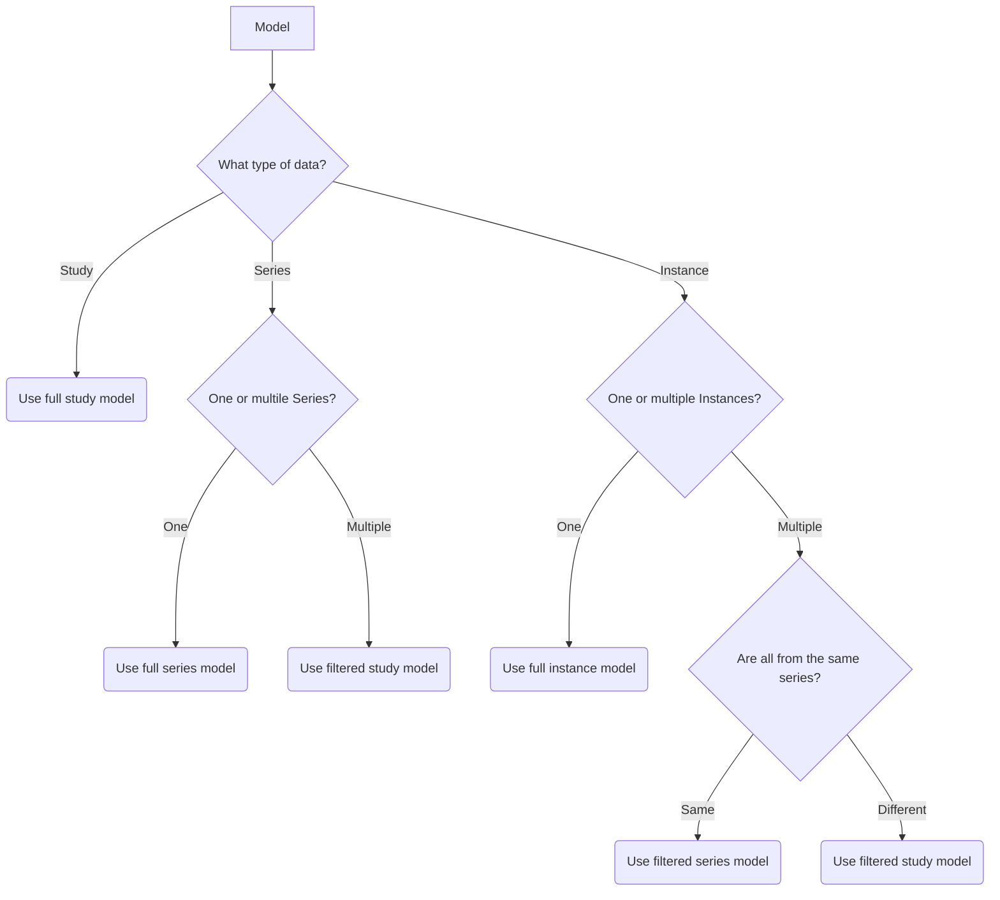

## Select your type of model



## Full Study Model

Full study model is a model that receives all instances from the study. This options should only be used if you have heuristics that know which data from the study to use for inference. Instances in this case are not grouped by series, they are provided as a list of objects with metadata.

Input data for this model is defined in [ModelInput_Study Schema](/latest/schemas/modelinputstudy). Select **Full study model input** from the _One of_ option.

### Full Study Model configuration

To add full study model to [Model Proxy](/latest/setting-up-model-proxy), you have to define it as following JSON object:

```javascript
{
  [{uuidv4}]: {
    "uri": "https://valid.model.uri/to/inference",
    "task": "segmentation" | "annotation" | "prediction",
    "supports": ["/studies"],
    "statusUri": (optional) string ("https://valid.model.uri/to/status/page")
  }
}
```

Important part of the configuration is the `supports` attribute. It should contain path to `/studies` and that allows your model to receive full list of instances from the study. Rest of the configuration should be created according to [model.json configuration](/latest/setting-up-model-proxy#modelsjson-add-model-api).

## Full Series Model

Full series model is a model that receives all instances from the series. Instances are provided as a list of objects with metadata.

Input data for this model is defined in [ModelInput_Series Schema](/latest/schemas/modelinputseries). Select **Full series model input** from the _One of_ option.

### Full Series Model configuration

To add full series model to [Model Proxy](/latest/setting-up-model-proxy), you have to define it as following JSON object:

```javascript
{
  [{uuidv4}]: {
    "uri": "https://valid.model.uri/to/inference",
    "task": "segmentation" | "annotation" | "prediction",
    "supports": ["/studies/series"],
    "statusUri": (optional) string ("https://valid.model.uri/to/status/page")
  }
}
```

Important part of the configuration is the `supports` attribute. It should contain path to `/studies/series` and that allows your model to receive full list of instances from the series. Rest of the configuration should be created according to [model.json configuration](/latest/setting-up-model-proxy#modelsjson-add-model-api).

## Full Instance Model

Full instance model is a model that receives only one instance as an input. Provided instance is an object instead of the list of objects like in the case of Study or Series data.

Input data for this model is defined in [ModelInput_Instance Schema](/latest/schemas/modelinputinstance).

### Full Instance Model configuration

To add full instance model to [Model Proxy](/latest/setting-up-model-proxy), you have to define it as following JSON object:

```javascript
{
  [{uuidv4}]: {
    "uri": "https://valid.model.uri/to/inference",
    "task": "segmentation" | "annotation" | "prediction",
    "supports": ["/studies/series/instances"],
    "statusUri": (optional) string ("https://valid.model.uri/to/status/page")
  }
}
```

Important part of the configuration is the `supports` attribute. It should contain path to `/studies/series/instances` and that allows your model to receive instance object selected by the user. Rest of the configuration should be created according to [model.json configuration](/latest/setting-up-model-proxy#modelsjson-add-model-api).

## Filtered Study Model

Filtered study object allows selecting multiple instances from multiple different series.

Input data for this model is defined in [ModelInput_Study Schema](/latest/schemas/modelinputstudy). Select **Filtered study model input** from the _One of_ option.

### Filtered Study Model configuration

To add filtered study model to [Model Proxy](/latest/setting-up-model-proxy), you have to define it as following JSON object:

```javascript
{
  [{uuidv4}]: {
    "uri": "https://valid.model.uri/to/inference",
    "task": "segmentation" | "annotation" | "prediction",
    "supports": ["/studies"],
    "statusUri": (optional) string ("https://valid.model.uri/to/status/page",
    "dataFilter": [
      {
        "dataKey": "series-one",
        "title": "First series",
        "dataFilter": [
          {
            "dataKey": "instance-one",
            "title": "First Instance from series"
          },
          {
            "dataKey": "instance-nth",
            "title": "Nth instance from series"
          }
        ]
      },
      {
        "dataKey": "series-two",
        "title": "Second series"
      }
    ]
  }
}
```

Important part of the configuration is the `supports` attribute. It should contain path to `/studies` and that allows your model to receive full list of instances from the study. Rest of the configuration should be created according to [model.json configuration](/latest/setting-up-model-proxy#modelsjson-add-model-api).

Configuration uses `dataFilter` property to filter data from study. Definition shown above forces user to select two series (`series-one` and `series-two`). The second series (`series-two`) is selected as a whole but the first one (`series-one`) asks user to select two instances from it (`instance-one` and `instance-nth`). Only those instances are sent to the model.

You can mix `dataFilter` elements to select exactly that your model needs for inference. Here are some examples:

```javascript
// Model uses two entire series
"dataFilter": [
  {
    "dataKey": "series-one",
    "title": "First series",
  },
  {
    "dataKey": "series-two",
    "title": "Second series"
  }
]
```

```javascript
// Model uses one instance from two selected series
"dataFilter": [
  {
    "dataKey": "series-one",
    "title": "First series",
    "dataFilter": [
      {
        "dataKey": "instance-a",
        "title": "A Instance from series one"
      }
    ]
  },
  {
    "dataKey": "series-two",
    "title": "Second series",
    "dataFilter": [
      {
        "dataKey": "instance-b",
        "title": "B Instance from series two"
      },
    ]
  }
]
```

## Filtered Series Model

Filtered series object allows selecting multiple instances from one series.

Input data for this model is defined in [ModelInput_Series Schema](/latest/schemas/modelinputseries). Select **Filtered series model input** from the _One of_ option.

### Filtered Series Model configuration

To add filtered series model to [Model Proxy](/latest/setting-up-model-proxy), you have to define it as following JSON object:

```javascript
{
  [{uuidv4}]: {
    "uri": "https://valid.model.uri/to/inference",
    "task": "segmentation" | "annotation" | "prediction",
    "supports": ["/studies/series"],
    "statusUri": (optional) string ("https://valid.model.uri/to/status/page",
    "dataFilter": [
      {
        "dataKey": "instance-one",
        "title": "First Instance from series"
      },
      {
        "dataKey": "instance-two",
        "title": "Second instance from series"
      }
    ]
  }
}
```

Important part of the configuration is the `supports` attribute. It should contain path to `/studies/series` and that allows your model to receive full list of instances from the series. Rest of the configuration should be created according to [model.json configuration](/latest/setting-up-model-proxy#modelsjson-add-model-api).

Configuration uses `dataFilter` property to filter data from series. Definition shown above forces user to select two instances (`instance-one` and `instance-two`) from current series. 