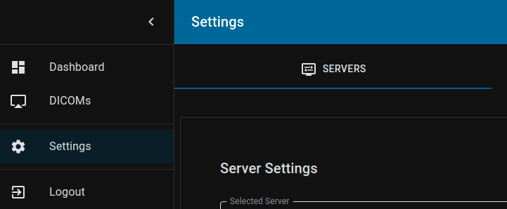
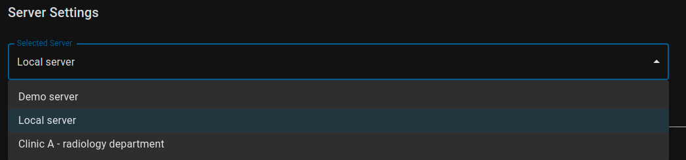
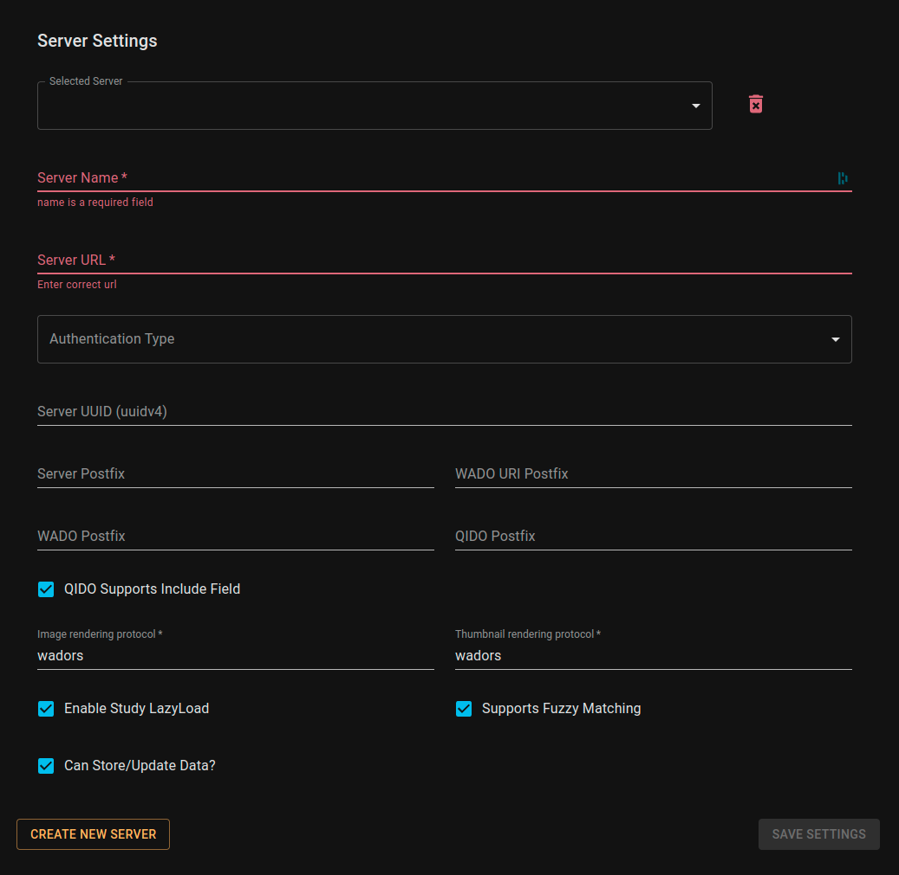
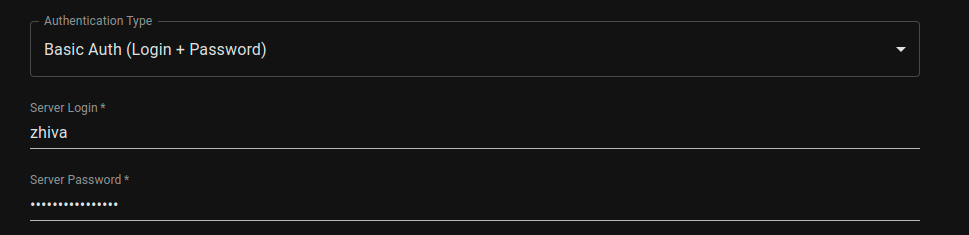
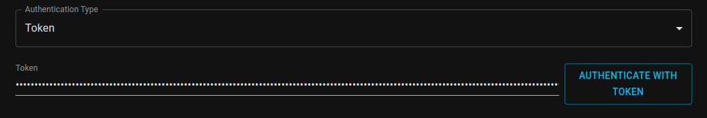
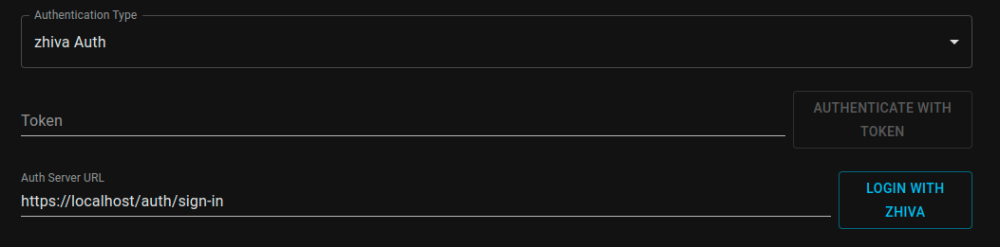
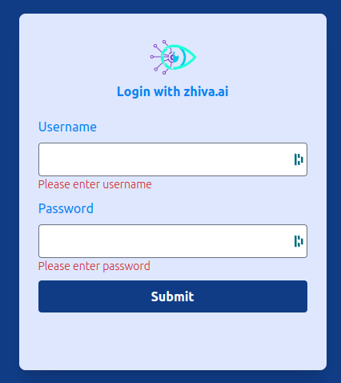

## Accessing server settings

To access server settings select `Settings` option form the main navigation and make sure `Servers` tab is selected:



## Selecting sever

Usually you should have a list of servers defined by your organization and available without setting them manually. Chose one by selecting it from the `Selected Server` dropdown.



After that confirm your choice by clicking on `Save Settings` button (bottom right of the page). Now in the `DICOMs` section, all study data should be loaded from selected PACS.

## Automatic configuration

If you're using [Local PACS with JWT](/latest/setting-up-local-pacs-with-jwt) you don't have to configure your server manually. You can either:
- Go to [Zhiva login](/latest/managing-servers-inside-the-dicom-viewer/#zhiva-login) and login with your [User account](/latest/setting-up-local-pacs-with-jwt#user-accounts).
- Use authentication link provided by admin (read more at [Authenticating users with token
  ](/latest/setting-up-local-pacs-with-jwt#authenticating-users-with-token))

Both methods should automatically set up your PACS and redirect you to list of your studies. 

You can also use your custom token server to setup PACS configuration. Just generate link:

```javascript
https://alpha.zhiva.org/auth/oauth?token=YOUR_AUTH_TOKEN
```

Where `YOUR_AUTH_TOKEN` is the same token as in [Token auth](/managing-servers-inside-the-dicom-viewer/#token-auth);

## Adding new server to the viewer.

> This guide assumes you already have a server that is available and secured with TSL. If you don't please follow the instructions to [Setup your Local PACS server](/latest/setting-up-local-pacs) or [Setup PACS with JWT](/latest/setting-up-local-pacs-with-jwt).

When the list is not complete, and you want to add your server to it just click the `Create New Server` button (bottom left of the page). That should create empty form for you to edit:



As you can see, this server is not on the list and is not a valid server yet. You have to enter required fields and `Save Settings` at the end.

### List of fields:
- __Server Name__ - Just a display name, visible on the list of servers
- __Server URL__ - Valid URL to the DICOM server. This path should be compatible with DICOMWeb standard and has to start with `https://`. If you're using our local server then it will look like `https://localhost/zhiva/pacs` or `https://192.168.1.2/zhiva/pacs` if the server is not on your local machine.
- __Authentication Type__ - Authentication type used by the server.
- __Server UUID__ - UUIDV4 of the server. If the server is used for inference it should have one. This UUID is sent along with the inference request to the model (see [`server` property](latest/setting-up-model-proxy#requesting-inference-for-given-model)).
- __Server Postfix__ - Any string that is part of the server url. Usually empty but some of the servers have additional postfix like `https://server.mydomain.com/pacs/DCM4CHEE` where `DCM4CHEE` is a `postfix`.
- __WADO URI Postfix__ - Another postfix in case the `WADO` (_Web Access DIICOM Objects_) protocol requires it. Usually `wado`.
- __WADO Postfix__ - If there is additional postfix after `WADO URI` then put it here. Often the value `rs` (_Request/Response_) is used but some servers doesn't have that requirement.
- __QIDO Postfix__ - Postfix for QIDO (_Query based on ID for DICOM Objects_) protocol. Works the same as other postfixes. Often `rs` but some servers leave it empty.
- __QIDO Supports Include Field__ - Whether QIDO supports __Include Fields__ option. It is used to retrieve additional metadata when requesting list of studies/series.
- __Image rendering protocol__ - Prefix for retrieving image data from the server. Usually it's `wadors` or `wado` but might be `https`.
- __Thumbnail rendering protocol__ - Prefix for retrieving thumbnail data from the server. Usually it's `wadors` or `wado` but might be `https`. Most of the servers use the same value as for __Image rendering protocol__ but if you have extra thumbnail server this value might differ.
- __Enable Study LazyLoad__ - Do not load the whole study at once. Only load selected series (speeds up loading)
- __Supports Fuzzy Matching__ - Does server supports _Fuzzy Matching_ when searching for Studies? ([Our Local Server](/latest/setting-up-local-pacs) does)
- __Can Store/Update Data?__ - Check if user has access to modify data on PACS (more about it in [Local PACS Security](/latest/local-pacs-security/) section)

### ZhivaAI Local Server Setup

We've created predefined server settings for [Our Local Server](/latest/setting-up-local-pacs). It is available under `Local Server` option. You might want to modify the `Server URL` to accommodate your local network settings. If you running the server on your local machine then leave `localhost` as hostname. If the server is somewhere in your network then change `localhost` to servers' IP address (sth. like `192.168.x.x`).

If you've changed other settings that affect the URL change them as well in the setting.

## Authentication

### Basic Auth

If your server is not available publicly and requires a login and password you can provide that information by selecting __Authentication Type__.



Selecting `Basic Auth` value allows you to enter credential that will be then used by the application to connect to PACS server. If you're using [our Local Server](/latest/setting-up-local-pacs) you can read more about securing your server in the [Authentication](/latest/setting-up-local-pacs#authentication) section. If you decide to create more restricted roles (__admin__/__editor__/__viewer__) please read [Local PACS Security](/latest/local-pacs-security/).

### Token Auth

If you have your own authentication server that uses __JWT__ you can provide your one-off login token to authenticate user.



This token will be sent to the server stored in the payload under __tokenServer__ property as HTTP header (`Authentication`). Full JWT payload definition is available here:

```javascript
{
  "name": string,
  "username": string,
  "canEditResource": boolean,
  "tokenServer": string,
  "refreshServer": string (optional),
  "pacs": string,
  "iat": number,
  "exp": number,
  "iss": string
}
```

__tokenServer__ should return __Access Token__ in response header (`Authenticaton`) and optional __Refresh Token__ in response body (`Content-Type: text/html`). __Refresh Token__ is required only if __refreshServer__ is provided in original token (one entered in the __Token__ field).

__Access Token__ returned by the __token Server__ should contain following fields:

```javascript
{
  "name": string,
  "username": string,
  "canEditResource": boolean,
  "aud": string (optional, recommended),
  "iat": number,
  "exp": number,
  "iss": string
}
```

### Zhiva login

If you're using our [Local PACS with JWT](/latest/setting-up-local-pacs-with-jwt) when you can user __zhiva Auth__ feature. It allows you to login using the credentials generated by the admin when creating [User account](/latest/setting-up-local-pacs-with-jwt#user-accounts).



Just enter __Auth Server URL__ (which in most of the cases is `https://localhost/auth/sign-in`) and you should be redirected to login page:



Just enter your credentials, and you'll be redirected back to the application with your server configured for you.