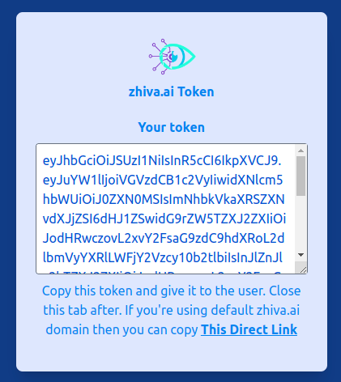

> This is an advance PACS configuration that might not be required if you're using PACS for your local project.

<h2>TLDR:</h2>

If you didn't get your TSL certificate file execute [Generate local TSL](/latest/setting-up-local-pacs-with-jwt#generate-local-tsl-certificate-only-once-every-365-days) first.

```shell
git clone https://github.com/zhiva-ai/pacs-token-server.git

docker-compose up
```

## Requirements

Before we start please make sure your server has access to:

- Unix-base shell
- [Docker](https://docs.docker.com/get-docker/)
- [Docker Compose](https://docs.docker.com/compose/install/)
- [OpenSSL](https://www.openssl.org/)

## Get the server code

You can either clone this repo

```shell
git clone https://github.com/zhiva-ai/pacs-token-server.git
```

or download it directly from
[zhiva.ai JWT PACS server](https://github.com/zhiva-ai/pacs-token-server/archive/refs/heads/main.zip).

## Generate local TSL certificate

(only once every 365 days)

> If you already have the `.crt` and `.key` files do not generate them again. Go straight to <a href="#build-the-server">Build the server section</a> and run your server with existing certificate.

Before we starty storing data on the server we have to secure the connection between the server and the viewer. We're going to use [Transport Layer Security (TSL)](https://en.wikipedia.org/wiki/Transport_Layer_Security). First, we have to generate certificate (`.crt`) and key (`.key`) files. Because we're doing it from the local server we're going to use [OpenSSL](https://www.openssl.org/) (we don't need external party to sign certificate, if you want to use it on the external server you should sign with something like [Let's Encrypt](https://letsencrypt.org/)).

To generate local certifiate please execute following command in the terminal window (make sure `openssl` is installed).

```shell
openssl req -x509 \
    -nodes -days 365 \
    -newkey rsa:2048 \
    -keyout zhiva.key \
    -out zhiva.crt \
    -subj "/C=PL/L=Wroclaw/O=Your Company, Inc./CN=localhost"
```

Change `-subj` to describe your organization:

- `C` - country code (2 letter code)
- `L` - location (city name)
- `O` - organization name
- `CN` - full domain name (use `localhost` for local servers)

Then copy `.crt` file as trusted certificate:

```shell
cat zhiva.crt > trusted.crt
```

## Setup your local server

At this point you should have 2 `.crt` files and 1 `.key` file. Check this by calling

```shell
 ls *.{crt,key}
```

from your main directory. It should return following result `trusted.crt zhiva.crt zhiva.key`.

If one of those files is missing go back to [Generate local TSL certificate](#generate-local-tsl-certificate-only-once-every-365-days) section and make sure you have all of them.

### Setup JWTs

#### Generate private and public tokens

```bash
openssl genrsa -out jwt_priv.pem 512
openssl rsa -pubout -in jwt_priv.pem -out jwt_pub.pem
```

#### Generate server settings

Run setup docker image
```bash
docker-compose --file ./setup/docker-compose.yml build zhiva_setup
docker-compose --file ./setup/docker-compose.yml run zhiva_setup
```

You should be prompted for admin password (`Enter the admin password: `). Store that password in your password management software becuase you won't e able to read it directly.

Setup configuration should be stored in `.env` file.

#### Build the server

For __Macbook M1/M2__ (any Apple Silicon chips):

- Go to `./auth-server/Dockerfile`
- change `FROM node:18-alpine` to `FROM node:18`

Run:
```shel
docker-compose up
```

For __everyone else__ (including macbooks with Intel chips):
```shell
docker-compose up
```

After starting the server you should be able to access [localhost/zhiva/app/explorer.html#upload](https://localhost/zhiva/app/explorer.html#upload) where you can upload your files.

> Important!!!
>
> You might be prompted with the message about invalid SSL certificate. This is caused by using OpenSSL to generate certificate for `localhost` and that certificate has no 3rd party that confirms its authenticity. It's fine for local network but remember to use proper certificate if the server is accessible from outside your network.

## User accounts

> Warning !!!
>
> Firefox has an issue with origin forwarding when "JavaScript code is running with enhanced privileges" which translates to "when running on not signed certificate website". This cannot be helper so please use another browser for things like generating tokens (e.g. Chrome).

For every user in your system you have to generate new user account. To do this, you should access [https://localhost/auth/token](https://localhost/auth/token) and enter required fields. __Admin Password__ is the password you've entered in [Generate server settings](#generate-server-settings). 


Enter user's new password


At the end you'll be presented with one-off __AuthToken__.



### Authenticating users with token

__Auth Token__ is used to sign-in user in zhiva application. You can use it in [Zhiva login](/latest/managing-servers-inside-the-dicom-viewer/#zhiva-login), or you can generate __one-off login URL__:

```javascript
https://alpha.zhiva.ai/auth/oauth?token=YOUR_AUTH_TOKEN
```

This link can bo modified if you're using different domain/subdomain than default `alpha.zhiva.ai`. Just replace the domain and leave the rest of the path the same. Link for the default domain is also stored in __This Direct Link__ just below textfield with token.

### Access to orthanc explorer

Because this version of the server works with tokens you have to generate one in order to access local explorer. To generate token you have to go through the proces from [https://localhost/auth/token](https://localhost/auth/token) again. At the end just copy the token and access explorer by adding this token as query parameter. Your URI should look like this:

```javascript
https://localhost/zhiva/app/explorer.html?token=YOUR_TOKEN_HERE
```

Remember to give your token __"Can edit PACS resources?"__ access, otherwise you won't be able to modify anything on the server.

This token expires in 24h or when the user uses it to login.

## Access from within internal network

If you have more than one computer inside your network (or VPN connection), then you can share the server settings with them. To check the server address please run the following command:

Linux or Mac:

```shell
ifconfig
```

Windows

```shell
ipconfig
```

and look for the setting with the `inet` value that starts with `192.168.`. That should by your address in the local network. You should be able to access the upload page from `https://192.168.x.x/zhiva/app/explorer.html`.

## Upload your DICOMs

Go to [localhost/zhiva/app/explorer.html#upload?token=YOUR_TOKEN_HERE](https://localhost/zhiva/app/explorer.html#upload?token=YOUR_TOKEN_HERE) and click on `Select files to upload`.


After selecting all the DICOMs click `Start the upload` to store them on the server.

All DICOMs are stored in [Docker's persistent volume](https://docs.docker.com/storage/volumes/) so even after restarting the server all your files are still accessible.

Now you should be able to access studies which were generated after uploading DICOM files. List of studies is available at [https://localhost/zhiva/app/explorer.html#find-studies](https://localhost/zhiva/app/explorer.html#find-studies).

## FAQs

- _"How to use this server with your DICOM viewer?"_

Detailed instruction is described in [Managing servers inside the DICOM viewer](/latest/managing-servers-inside-the-dicom-viewer#zhivaai-local-server-setup) guide.

- _"Why my server doesn't accept very large DICOM files?"_

There is an maximum file size setting inside server config. If you want to change that please go to `./nginx.conf` and modify:

```nginx configuration
client_max_body_size 2000m;
```

## Customization

### URL

You're able to change server url by modifying two settings:

- `orthanc.json` - inner server settings
- `nginx.conf` - main server settings

Inside `orthanc.json` go to `DicomWeb` attribute and change `Root` property. This property is responsible for path to `dicom-web` server (the one used by the viewer).

```javascript
// orthanc.json
{
  "DicomWeb": {
    [...]
    "Root": "/pacs/"
    [...]
  }
}
```

If you want to change main path to your server you have to modify the second setting (`nginx.conf`). Path is defined as a location and rewrite (reverse-proxy). Change following lines

```javascript
// nginx.conf
[...]
    location /zhiva {
      [..]
      rewrite /zhiva(.*) $1 break;
    }
[..]
```

you can change it to:

```javascript
// nginx.conf
[...]
    location /serv {
      [..]
      rewrite /serv(.*) $1 break;
    }
[..]
```

and access your server at `https://localhost/serv/...`

### Storage

Currently, all the data are stored in [Docker's persistent volume](https://docs.docker.com/storage/volumes/). This is volume created by Docker itself. If you want to specify the path please follow the instruction from the [Docker Docs](https://docs.docker.com/compose/compose-file/compose-file-v3/#short-syntax-3) about setting up directories as volumes.
